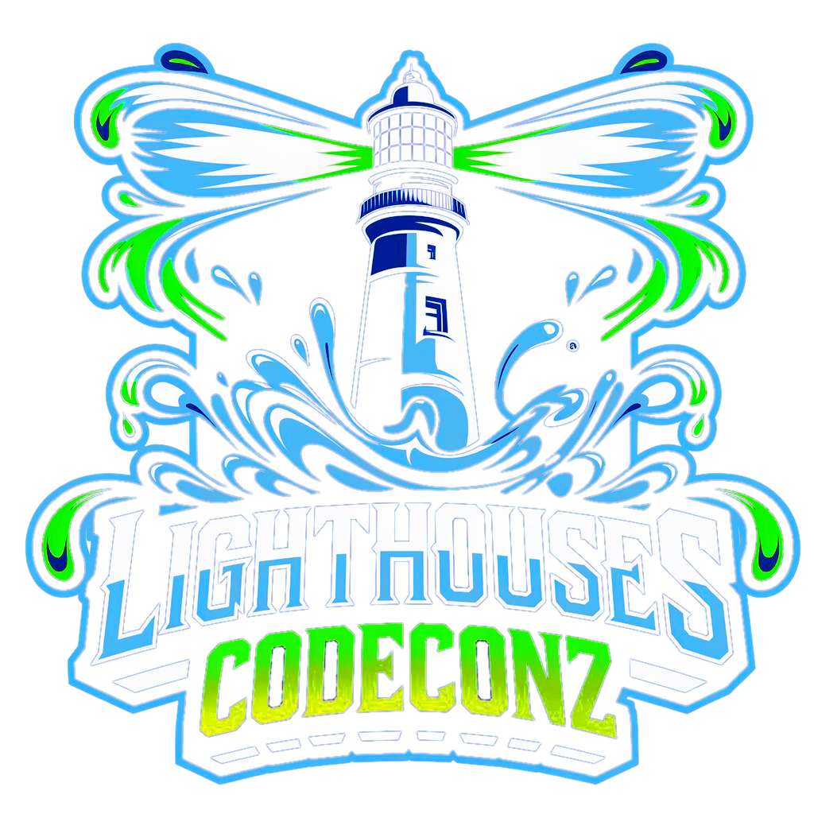

<p align=center>
    
</p>

# Lighthouses AI Contest "Reloaded"

Lighthouses AI Contest is a turn based game built by [Hector Martin aka "marcan"](https://github.com/marcan/lighthouses_aicontest),
as the challenge for the AI contest within one of the largest and oldest demoparty and LAN party,
the [Euskal Encounter](https://ee32.euskalencounter.org/) in Bilbao, Spain.

We are proud to present the "Reloaded" version of the contest, which features a new engine from scratch written in Go
and a proper GRPC API for the engine to communicate with the bots.

- [Game Instructions](https://coda.io/@gabri-igz/lighthouses)
- [Game Engine Documentation](docs/game_engine.md)
- [Game Visualizer](https://intelygenz.github.io/codeconz-lighthouses-engine/)
- [Map Generator](https://dovixman.github.io/lighthouses_map_generator/)
- [Go bot template](https://github.com/intelygenz/codeconz-lighthouses-go-bot)
- [Python random bot template](https://github.com/intelygenz/codeconz-lighthouses-py-bot)
- [Python Reinforcement Learning bot template](https://github.com/intelygenz/codeconz-lighthouses-py-rl-bot)

To start building a bot, you will need to take the following steps:

## Prerequisites

- Install [Docker](https://docs.docker.com/engine/install/#release-channels)
- Make sure you have a [GitHub account](https://www.github.com)
- Clone this repository in your local machine

## Create a new bot repository

- Create a new repository using one of the following templates (you can also start from scratch!):

  - [Go bot template](https://github.com/new?owner=intelygenz&template_name=codeconz-lighthouses-go-bot&template_owner=intelygenz)
  - [Python random bot template](https://github.com/new?owner=intelygenz&template_name=codeconz-lighthouses-py-bot&template_owner=intelygenz)
- Clone it in your local machine

Considerations:

- Make sure the bot repository is owned by one of your team members.
- The repository can be public or private.
- Only one repository is needed per bot.
- The name of the bot that will show at the [Game Visualizer](https://intelygenz.github.io/codeconz-lighthouses-engine/) will be `{username}-{repository}`. E.g. `intelygenz-codeconz-lighthouses-py-bot`

## Build an amazing bot!

> "What we do in life, echoes in eternity." - Maximus Decimus Meridius

If you are curious about the game engine internals, you can check the [Game Engine Documentation](docs/game_engine.md)

## Test your bot!

### Push your changes

Bot repository templates contain a `build-push-github.yml` workflow file that will build and push the bot image to the GitHub Container Registry.
This action is triggered when you push or merge to the main branch of the repository.
If you decided to start from scratch, you will need to create a similar workflow file.

Make sure the action is successful and the image is pushed to the GitHub Container Registry.

### Make the image public

For the engine to be able to pull the bot image, you need to make it public.

- Click on the package that was created by the GitHub Action in the "Packages" section of your bot repository, at the bottom of the right column menu.
- In the package page, click on "Package Settings" at the bottom of the right column menu.
- At the bottom of the Package Settings page there's a "Danger Zone" section. Click on "Change visibility" and make the package public.

You can also take this opportunity to copy the label of the image, which should be something like `ghcr.io/{username}/{repository}`.
There's no need to include the `:latest` tag.

### Run the game

Go to the engine repository and folder and run `./start-game.sh -f game.cfg`.

After the game ends, some resources will be generated:

- `/logs`: logs of the game and each bot that participated.
- `/output`: JSON files to be used for visualization.

You can also run `./start-game.sh -h` to see the available options.

### Visualizing and diagnosing a game

To visualize and analyze the game, you can upload a JSON file from the `/output` folder to the [Game Visualizer](https://intelygenz.github.io/codeconz-lighthouses-engine/).
This tool will help you check what your bot did during the game and how it performed.

*Remember that the name of the bot in the [Game Visualizer](https://intelygenz.github.io/codeconz-lighthouses-engine/) will correspond with the name of the image: `{username}-{repository}`*

### Customizing the game

If you are running the game with no changes at the `game.cfg` file, the game will run with the competition configuration,
a single random python bot playing against itself and a simple map.

You will probably want to:

- Add your own bot to the game: `bots=('ghcr.io/{username}/{repository}' 'ghcr.io/intelygenz/codeconz-lighthouses-py-bot:latest')`
- change the configuration to test your bot under different scenarios.

#### Configuration

To change the game configuration, you can edit the `game.cfg` file at the root of the engine repository:

- `bots`: an array of bot images that will play the game.
- `map`: the map file that will be used in the game.
- `turns`: the number of turns the game will last.
- `turn_request_timeout`: the time the engine will wait for a bot to respond to a turn request.
- `time_between_rounds`: the time the engine will wait between rounds.

#### Add more maps

You can find some included maps in the engine repository at the `/maps` folder,
but those are not very challenging and will only serve you as a starting point.
You are expected to create your own maps to test your bot under different scenarios.

To do so:

- use the [Map Generator](https://dovixman.github.io/lighthouses_map_generator/) to generate a new map
- copy the generated map to the `/maps` folder in the engine repository
- update the `game.cfg` file to use the new map: `map={map_name}.txt`

E.g., after downloading a map named `island.txt`, you would update the `game.cfg` file by setting `map=island.txt`

*Remember that the competition will take place on a 43x23 grid!*
*Also remember that the competition will take place on maps that will not be revealed until the contest starts!
Be prepared for anything!*

#### Add some competition

You will probably want to test your bot against other bots.
You can add more bots to the game by adding more elements to the `bots` array in the `game.cfg` file.

The base python bot is a random bot that you can use for testing purposes.
To be able to add as many instances of this bot as you want, you need to follow these steps:

- Make sure you pulled the bot image: `docker pull ghcr.io/intelygenz/codeconz-lighthouses-py-bot:latest`
- Generate as many tags from the base image as you want: `docker tag ghcr.io/intelygenz/codeconz-lighthouses-py-bot:latest {}/{}/{}`.
  You only need to replace the three `{}` with any string you want.

Example

```bash
docker tag ghcr.io/intelygenz/codeconz-lighthouses-py-bot:latest local/local/bot-1
docker tag ghcr.io/intelygenz/codeconz-lighthouses-py-bot:latest local/local/bot-2
docker tag ghcr.io/intelygenz/codeconz-lighthouses-py-bot:latest anything/anything/bot-3
```

```cfg
# game.cfg
bots=('ghcr.io/{username}/{repository}' 'local/local/bot-1' 'local/local/bot-2' 'anything/anything/bot-3')
```

These tags will only be available locally and `./start-game.sh` will fail when trying to pull them.
To overcome this, you can use the `-x` option: `./start-game.sh -xf game.cfg`.

## Debugging

You can run your engine and your bots locally to debug any issues you may
encounter.

First, you need to run the game server. To run the engine locally, you can use
the following command:

```bash
make rungs
```

Then, you can run your bot locally. Instructions to run bots are available in
the bot repositories.

- [Go bot](https://github.com/intelygenz/codeconz-lighthouses-go-bot)
- [Python random bot template](https://github.com/intelygenz/codeconz-lighthouses-py-bot)

The engine has a timeout of 5 seconds, waiting for bots to join. After that, the
game will start if there are any players available.

In case you need to increase the timeout, you can do so by setting the
`JOIN_TIMEOUT` environment variable:

```bash
export JOIN_TIMEOUT=10s
make rungs
```
